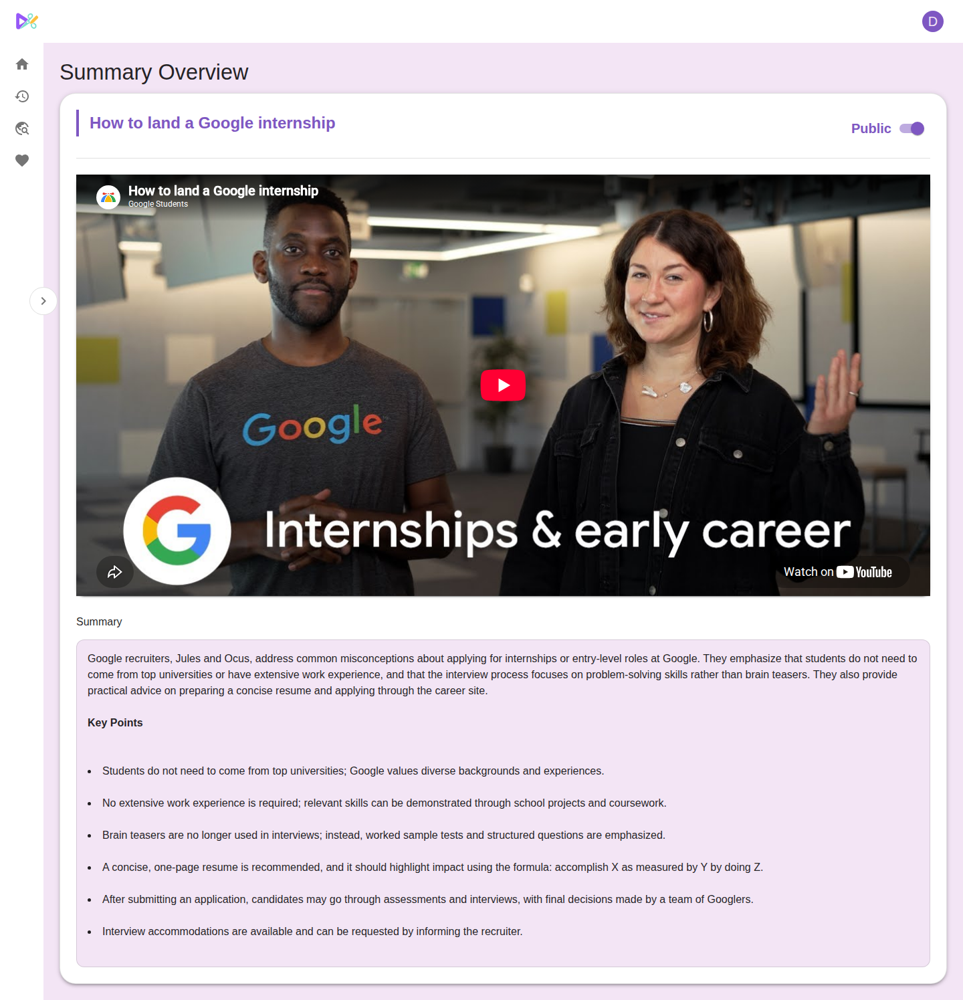
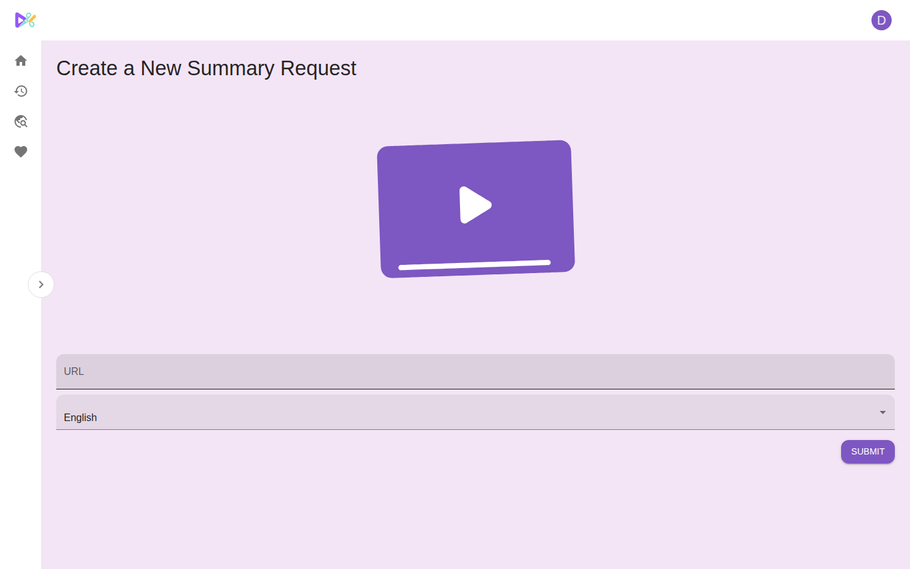
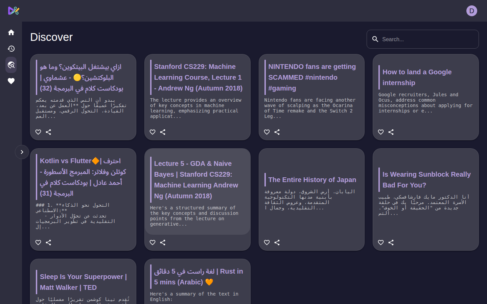
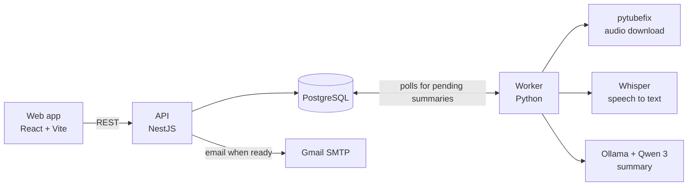

# SnipScribe

Turn YouTube videos into short summaries with key points, in English or Arabic.

Paste a YouTube link. SnipScribe downloads the audio, transcribes it with Whisper and summarizes it with Qwen 3 running locally in Ollama, so no paid AI APIs are involved.

This repository holds the web app and the API. The transcription and summarization worker lives in [snipscribe](https://github.com/Mostafa-Safwat/snipscribe).


## Features

-   Get each summary in English or Arabic, with a right-to-left layout for Arabic
-   Read an overview paragraph and a list of key points below the embedded video
-   Make summaries public, then browse and search everyone's public summaries in Discover
-   Keep favorites and a history of your requests
-   Get an email when a summary is ready
-   Switch between light and dark themes

## Screenshots



| New summary request                                                   | Discover (dark theme)                                              |
| --------------------------------------------------------------------- | ------------------------------------------------------------------ |
|  |  |

## How it works



1. The web app sends the link and language to the API. The API stores the request with a pending summary for the video.
2. The [worker](https://github.com/Mostafa-Safwat/snipscribe) picks up pending summaries. It downloads the audio, transcribes it, summarizes the transcript, marks the summary completed and queues a notification.
3. A cron job in the API emails each queued notification, unless the user turned notifications off.

The web app talks to the API through a client generated from the API's OpenAPI spec, so the frontend and backend share one set of types.

## Tech stack

| Part    | Built with                                                                                  |
| ------- | ------------------------------------------------------------------------------------------- |
| Web     | React 19, TypeScript, Vite, MUI, Redux Toolkit, Formik and Yup                              |
| API     | NestJS 10, Prisma 6, PostgreSQL, JWT auth in HTTP-only cookies, Swagger/OpenAPI, Nodemailer |
| Worker  | Python, pytubefix, OpenAI Whisper, Ollama (Qwen 3)                                          |
| Tooling | Turborepo with Yarn workspaces, Docker Compose, ESLint and Prettier                         |

## Project structure

```
apps/
  api/                  NestJS REST API, with Swagger docs at /docs
  web/                  React frontend
packages/
  database/             Prisma schema, migrations and client
  typescript-client/    API client generated from the API's OpenAPI spec
  config/, tsconfig/    Shared ESLint and TypeScript config
```

## Running locally

You need Node.js 22+, Yarn 1, Docker, and Java, which the OpenAPI client generator runs on. To actually produce summaries, also set up the [worker](https://github.com/Mostafa-Safwat/snipscribe).

```sh
# 1. Install dependencies
yarn install

# 2. Start PostgreSQL, plus Adminer at http://localhost:8081
docker compose up -d

# 3. Create the env files (the defaults match docker-compose.yml)
cp apps/api/.env.example apps/api/.env
cp packages/database/.env.example packages/database/.env

# 4. Create the database tables
yarn workspace @snipscribe/database db:migrate-prod

# 5. Generate the Prisma client and the typed API client
yarn turbo run build --filter=@snipscribe/typescript-client

# 6. Optional: create an admin account from the SEED_ADMIN_* values in apps/api/.env
yarn seed

# 7. Start the API and the web app
yarn dev
```

Open http://localhost:3000. The API docs are at http://localhost:3001/docs.

Emails are sent through Gmail. To turn them on, set `GOOGLE_APP_USERNAME` and `GOOGLE_APP_PASSWORD` (a Gmail app password) in `apps/api/.env`. Without them, everything else still works.
